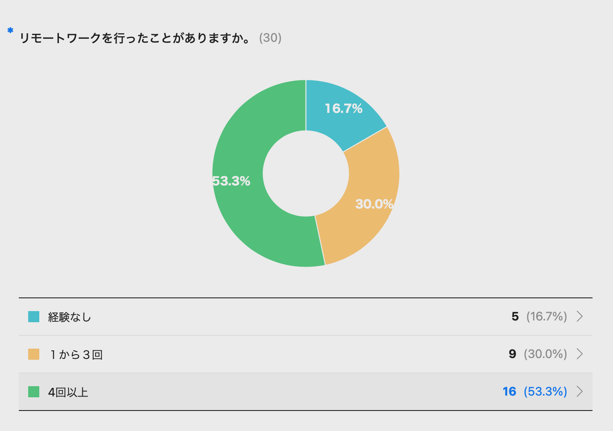
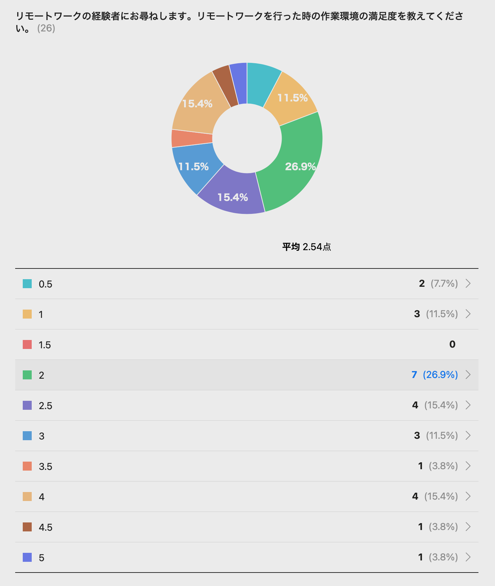
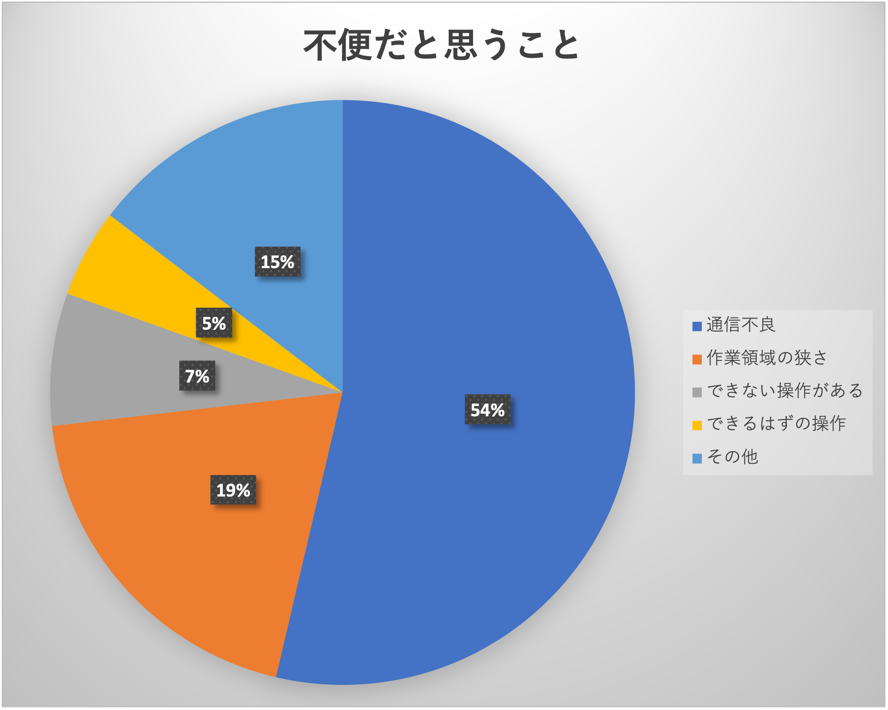
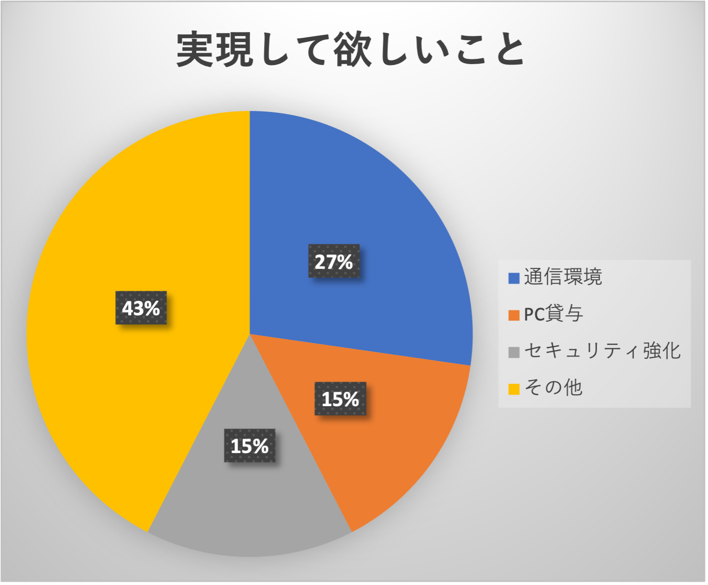
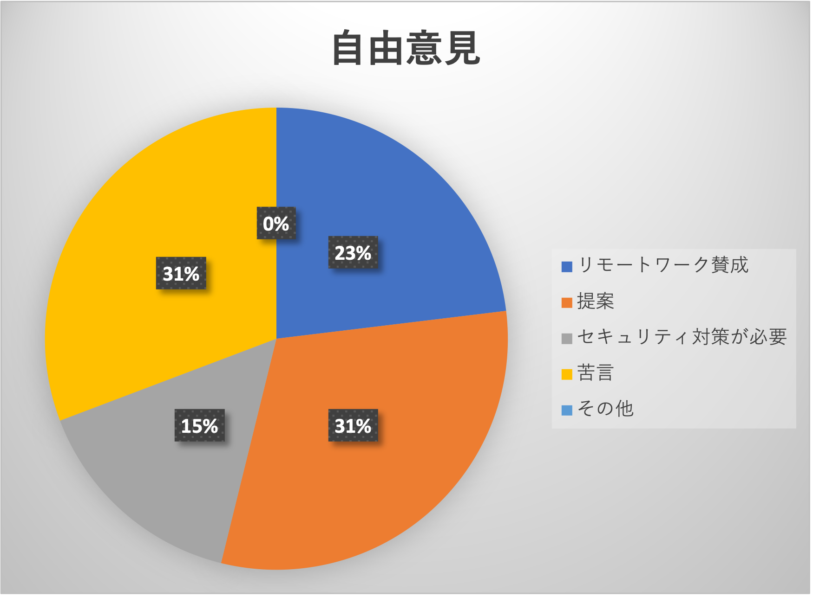

<p style="text-align:center;font-size:30px;">リモートワークアンケート<br>結果報告</p>
<p style="text-align:right">2022年2月9日　情報システム課　長岡暁弘</p>

## 目次
[toc]

## 1.概要
当社ではGoogle Remote Desktopを利用して社内のPCにアクセスし、リモートワークを行っているが、使いにくいということが言われている。
昨今のコロナ禍の状況において、ますますリモートワークのニーズが増している為、現在の問題点を把握し改善を図るため、金沢支社の管理部門を対象にアンケートを行った。

その結果リモートワークの満足度は低く、以下のような改善が必要。

- 効率を下げてまでリモートワークを行うことに疑問も持つ人に対する説明が必要
- セキュリティに不安を持つ人がいる。セキュリティ対策をどうするかの説明が必要
- <span style="background-color:palegreen;">リモートワークをしている人としていない人との格差?（[意見１](#kakusa1)、[意見２](#kakusa2)、[意見３](#kakusa3)、[意見４](#kakusa4)）</span>が生じている。その是正策の検討が必要
- 通信不良の問題が大きいので、通信方式や手段の見直しが必要
- 押印や電話対応の時不都合があるので、その対策が必要

> note
> 
> リンクをクリックして意見そのものを参照するとき、わかりやすいように次の背景色を利用している。
>
> - <span style="background-color:palegreen;">格差の意見</span>
> - <span style="background-color:pink;">否定的な意見</span>
> - <span style="background-color:yellow;">セキュリティに対する不安</span>
> - <span style="background-color:skyblue;">提案</span>
> - <span style="background-color:orange;">不便</span>

## 2.リモートワークの経験
アンケートに回答者30名のリモートワーク経験者の割合です。管理部門全員が回答したわけではないので、経験者の回答が多かった。



## 3.作業環境の満足度
使いにくいと言われているが、実際の満足度を5点満点で回答してもらった。平均点は2.54点だが、2点が7名と一番多く満足度は低いのではないか。



## 4.リモートワークで不便だと思うこと
不満足の原因を探るため、リモートワークの環境で不便だったことを答えてもらった。


以下の３つについては、現状でも「できるはずの操作」である。回答者に確認が必要。

1. PCから直接、共有フォルダへのアクセスができない
2. 会社のネットワークにつながらないので、事前に必要なフォルダなどをＰＣにダウンロードしておかなければならない。会社に戻ったときに再度データーを入替えたりしなければならない
3. 共有フォルダへのアクセスができない

## 5.リモートワークで実現して欲しいこと
さらに、リモートワークを推進するためにはどのようなことが必要かも答えてもらった。



## 6.自由意見
最後に自由意見を答えてもらった。提案、セキュリティ強化を求める声、さらには苦言が数多く含まれていて、今後の改善の参考としたい。



## 7.改善提案
まず、<span style="background-color:pink;">リモートワークについて否定的な意見が見受けられた（[意見１](#opinion1)、[意見２](#opinion2)）</span>。何のためにリモートワークが必要なのか、会社としての意識の統一が必要。

次に、<span style="background-color:yellow;">セキュリティに対する不安（[意見１](#security1)、[意見２](#security2)）</span>が寄せられた。また、<span style="background-color:skyblue;">セキュリティ対策の方法の提案（[提案１](#security11)、[提案２](#security12)、[提案３](#security13)、[提案４](#security14)）</span>もあげられていた。ただセキュリティを厳しくすると使い勝手が悪くなるので、情報の種類による優先順位を決めてセキュリティ対策を行う必要がある。

通信不良が原因と思われることで生じる不都合が多く寄せられた。現在利用しているGoogle Remote Desktopは無料のためか使いこなすためのノウハウが必要で、不便なことが多い。[splashtop](https://www.splashtop.co.jp)などの有料で使いやすい方法を検討する必要がある。また、NTTグループで利用している[シン・テレワークシステム](https://telework.cyber.ipa.go.jp/news/)やNECグループで利用している[ThinclST](https://jpn.nec.com/thinclst/)も検討してみても良いかもしれない。

セカンドディスプレイの貸し出しや購入補助の検討も必要かもしれない。リモートワークにより電気代が増えてしまったという意見もあった。

最後に、<span style="background-color:orange;">[押印](#inconvenience3)、[電話対応](#inconvenience1) や[郵便物の確認](#inconvenience2)で不便</span>を感じているという回答があった。リモートワークにおける典型的な対応が必要な項目なので、対応を急がなければならない。

## 8.回答内容
以下に、実際の回答をカテゴリごとに紹介する。

### 8.1 リモートワークで不便だと思うこと
「通信不良」、「作業領域の狭さ」、「できない操作がある」、「その他」のカテゴリごとに回答内容を並べる。

#### 8.1.1 通信不良
1. 通信速度が遅い。途切れる。出社時と比べて、業務効率・生産性は1/10。職員にはただ休みをを与えているだけ
1. Word・Outlookが使えない（表示されない、固まる）
1. カーソル移動やマウスの反応が遅い、ネットが遅くなる
1. マウスの反応、キーボードで入力した文字の表示反応の遅さ。社内ツール（LINEWORKS）を使用中にフリーズしやすい
1. ネットワーク不通。2021年までは本社の環境由来で使用できないことがよくあった（現在解消済？）
1. Excel等をリモート画面で入力するのは、動作が重く難しい。ネットの調子が悪いと、リモート画面での作業が止まる
1. カーソル移動やマウスの反応が遅い
1. 表示が消えてしまうことがある
1. Wi-Fiの繋がりが遅いときもある
1. 全体的に動きが遅い。1画面での作業となるため作業効率が悪い。年始の時ネットワークに接続できず作業が出来なかった。画質が不鮮明。
1. 画面が真っ黒になり何もできなくなる
1. たまにネットワークがとぎれる。（最初の画面に戻る）フリーズする
1. 突然消えることが多々ある。フリーズする
1. カーソル移動や文字入力の反映が遅くて仕事がやりにくい
1. 会社で使ってるパソコンより速度が遅い
1. とにかく反応が遅いため、作業効率が大きく低下した
1. 全体的に動きが遅い
1. outlookの表示が消えてしまう、反応が遅い
1. Wi-Fi環境の準備
1. 途中で通信が切れてしまうことがある
1. 社内のネットワーク影響で画面がよく動かなくなる

#### 8.1.2 作業領域の狭さ
1. 普段2つのディスプレイを使用していて、リモートワークにしたときにそのままの表示になる。リモートワークでは１つの画面でしか作業できないので、ファルダを開いたときにディスプレイ２の方で開かれると不便に感じる
1. モニターがないため、同時に何個も資料を開いて確認するのが難しい
1. マルチディスプレイにできない
1. サブの画面（EIZO）のディスプレイがないので、15インチのノートＰＣだけで行うと、効率が悪く、また目が疲れる
1. 画面が小さく見にくい
1. 画面表示が小さくて操作ミスしやすい。等倍や拡大表示できるようにしたい
1. 1画面しかない
1. マルチディスプレイができない

#### 8.1.3 できない操作がある
1. リモート先PCのショートカットキーが効かない
1. 貸し出しPCを利用させてもらったが、テンキーがなく作業しづらい

#### 8.1.4 その他
1. <a id="inconvenience1"></a><span style="background-color:orange;">電話対応。相手にWORKSアカウント・アプリがあればトークから通話を利用しするようにしているが、アカウントなし・アプリなしの社員さんや社外の方へは私物携帯を使用している状況</span>
1. <a id="inconvenientce3"></a><span style="background-color:orange;">押印含めた紙媒体での業務対応ができない</span>
1. <a id="inconvenience2"></a><span style="background-color:orange;">郵便物の確認ができない。出社している人頼り（負担増）になってしまう</span>
1. 会社のネットワークにつながらないので、事前に必要なフォルダなどをＰＣにダウンロードしておかなければならない。会社に戻ったときに再度データーを入替えたりしなければならない
1. ビデオ会議をする際に部屋のバックが映るので、緑の布を購入した。（普段は不要のもの）
1. オンライン会議などに必要なイヤホンマイクの整備

### 8.2 実現して欲しいこと
「通信環境」、「PC貸与」、「セキュリティ強化」、「その他」のカテゴリごとに回答内容を並べる。

#### 8.2.1 通信環境
1. 通信速度がの向上
2. もうちょっとスムーズな動きで作業できるようになったらリモートワークしやすい
3. リモート環境の向上。そもそも出社してもIT環境が悪い、その中でリモートするのだからより環境はさらに悪い。
4. ローカル環境に近い反応速度の環境が必要
5. 快適な通信環境の整備
6. リモートデスクトップでは無い接続
7. Wi-Fi環境の準備。
8. ネットワークの改善

#### 8.2.2 PC貸与
1. ファイルのクラウド化（貸与されているPCを持ち帰るだけ）
2. 会社で空いているディスプレイがあれば貸出対応してほしい。私物使用しているため個人的には不要だが、他の人は会社2画面・自宅1画面で不便/効率が落ちている模様
3. 安定した接続環境、出来ればモニター貸し出し
4. PC貸与
5. １人１台継続して長期で借り続けたい。できたら１人に対しリモート用のパソコンを支給してほしい。

#### 8.2.3 セキュリティ強化
1. <a id="security11"></a><span style="background-color:skyblue;">電子印、電子署名</span>
2. <a id="security1"></a><span style="background-color:yellow;">セキュリティ対策強化。現状会社PCからアクセスできるデータは自宅PCへも自在に移動できてしまう。移動したデータは削除する等ルール明確化・策定と管理が必要では</span>
3. <a id="security12"></a><span style="background-color:skyblue;">ID/PWなしでの作業環境への接続ができればよい</span>
4. 当課はoutlookの使用頻度が高いためセキュリティ面や使い勝手等含めメールソフトの代替案の検討
5. <a id="security13"></a><span style="background-color:skyblue;">リモートではなくクラウド接続ログイン</span>

#### 8.2.4 その他
1. リモートデスクトップではなくリモートアプリによる作業が可能なものの幅が広がればいいと感じる。
2. PCが不得意な職員（管理者）へのPC操作基礎講座。Excelの基礎やPDFの扱い、電子印設定・使用方法など
3. 使えるツールやその使用方法の共有を勧めてほしい。スプレッドシート・PDF編集ソフト・電子印アプリ等々
4. <a id="kakusa2"></a><span style="background-color:palegreen;">朝礼でのお知らせ（口頭でのお知らせ）共有</span>
5. <a id="kakusa3"></a><span style="background-color:palegreen;">施設事務員へのリモートワーク適用推奨。感染拡大時・クラスター発生時など　交代ででもリモートできやすいようにハード・ソフト両面の環境整備をしてほしい</span>
6. <a id="kakusa4"></a><span style="background-color:palegreen;">出勤状況や、在席・離席の状況がわかるようになってほしい。社内の状況が分かりづらい。</span>
7. リモートアプリ？自分のパソコンのデスクトップへ保存しているファイルなどは変わらずそのまま使用したい
8. リモートワークの作業環境の改善
9. iPadから会社PCへリモート接続
10. 2画面で作業できるようになってほしい
11. マルチディスプレイができない
12. 共有フォルダへのアクセスができない
13. オンライン会議などに必要なイヤホンマイクの整備
14. 画面が見やすくなると助かります

### 8.3 自由意見
「リモートワーク賛成」、「提案」、「セキュリティ強化が必要」、「苦言」、「その他」のカテゴリごとに回答内容を並べる。

#### 8.3.1 リモートワーク賛成
1. 会社としてリモートワークをさらに推進して欲しいと思います。
2. 金沢支社は狭く「密」なので可能な限りリモートワークを勧めてほしい。
3. 通勤時の渋滞などのストレスがないのが良いです。

#### 8.3.2 提案
1. 毎朝の健康チェックは紙からスプレッドシート等に変更して、リモートの人の分も確認したほうがいいのでは
2. 在宅用のディスプレイの購入に補助が出ると嬉しいです。
3. 昨年冬にリモートワークをした際、電気代が跳ね上がった！（在宅勤務手当などがある企業もニュースで聞くが）
4. コロナに限らず、これからのワークスタイルとしてリモートワークができれば良いと思います。  
→ただ、「介護の仕事は現場で」とのイメージが強く、多くの職員が現場で頑張っているのに「自宅でＰＣというのは、楽をしているのでは」と誤解する人も多いと思いますが、それはどのような仕事も同様だと思うので。

#### 8.3.3 セキュリティ強化が必要
1. <a id="security2"></a><span style="background-color:yellow;">自前のPC使用している職員ももちろんいるのでセキュリティ面等での不安はあります。</span>
2. <a id="security14"></a><span style="background-color:skyblue;">本格的なテレワーク導入には情報の持ち出し対策が不可欠</span>

#### 8.3.4 苦言
1. <a id="opinion1"></a><span style="background-color:pink;">業種柄、現場が365日24ｈ稼働しているため電話・郵送等アナログな対応が必須であることから、出社してくれるスタッフに対して優遇措置があると不公平感がなくなる。（現場ファースト）出社している人がリモートしている人にファイル送るなどの問い合わせ対応をしなければ行けないのは本末転倒。</span>
2. <a id="opinion2"></a><span style="background-color:pink;">リモートワークの認識をどう持てばいい?</span>

   ```
【リモートワークのイメージと疑問】 
・勤務環境を楽にするための物？
・働き方改革？
コロナ感染予防の為？
・上司や幹部陣ほどリモートしないのは？
・人の目を気にせず自分時間で勤務できるとういうメリットでリモートしている人が多いと思うが…
   ```

3. <a id="kakusa1"></a><span style="background-color:palegreen;">リモート格差？がなくなれば…</span>

   ```
（リモートできる作業、できない業務を担当しているとそもそもリモートできない）
（リモートする人はしなくて、してない人はしないといけない事があるのはなど…掃除など）
※リモート推奨にとどまるのが？リモート必須にし出社を申請する方がよいのでは？
推奨程度なら出社して業務したほうが良い
必須なら自宅環境を整えて業務効率をあげる自己努力が必要と感じている
   ```

4. 貸出用のPCの在庫が心配です
5. リモートだけではなく、とにかく社内ネットワーク環境を改善して欲しいです。会計システムなどの基幹業務システムが頻繁に遅くなる、止まるのは本来あり得ないことだと思います。
業務に支障が出る度に表面的に対応するのではなく、根本的な改善を望みます。


